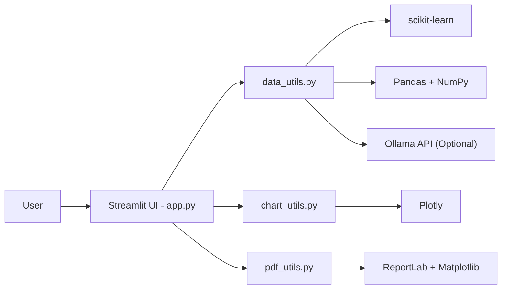
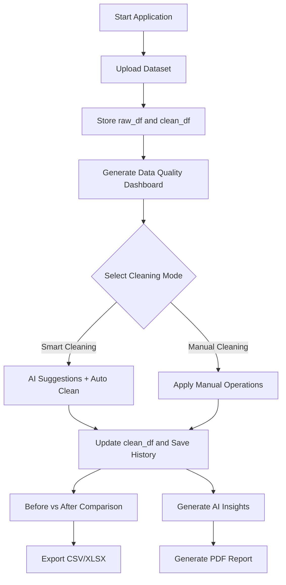
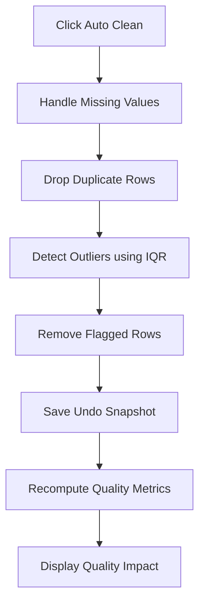
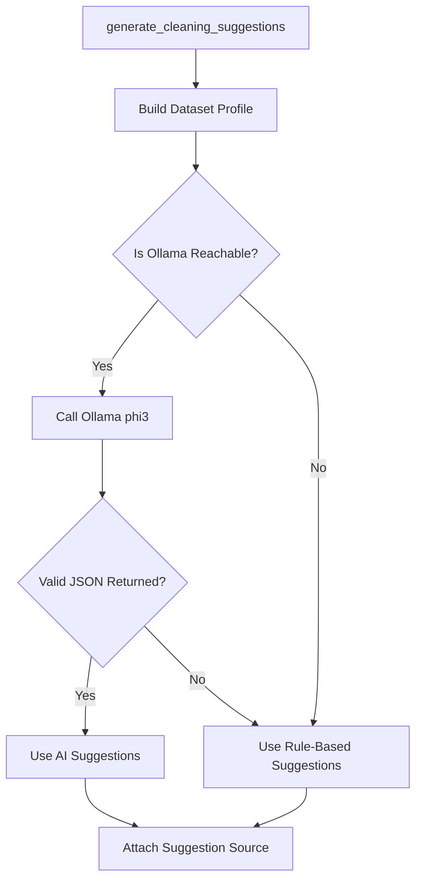
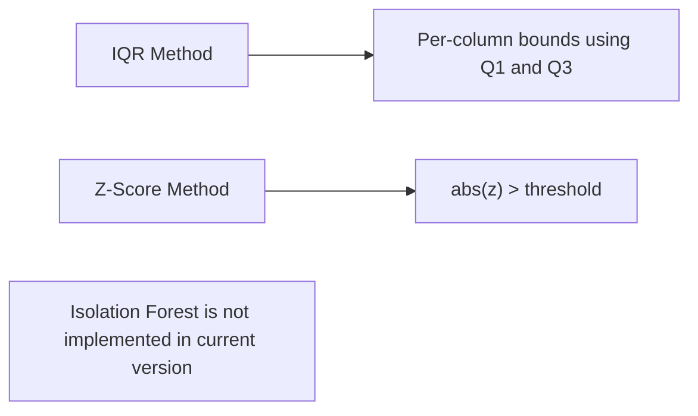
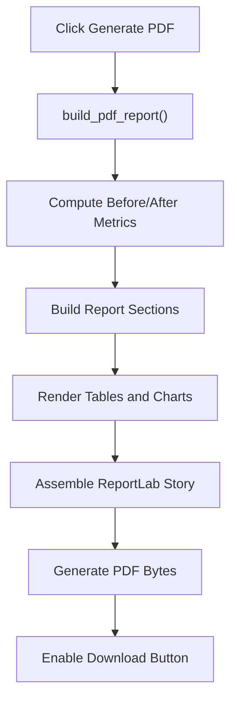
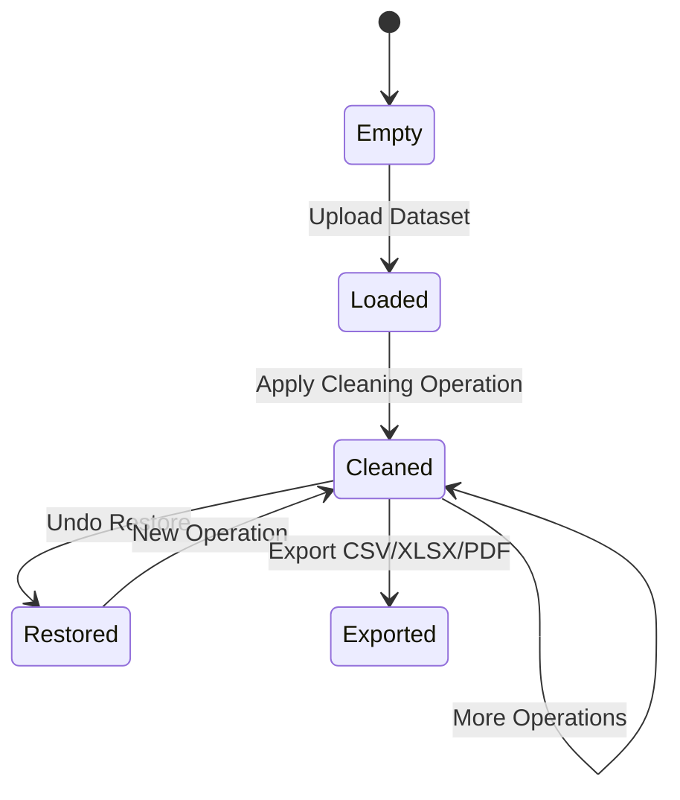

# DataRefine - AI Data Cleaner

DataRefine is a Streamlit-based AI-powered data cleaning and profiling tool designed for messy real-world datasets. It helps users upload datasets, profile data quality, apply smart/manual cleaning operations, generate AI-driven insights, compare before-vs-after transformations, and export professional PDF reports.

---
# Live: (https://datarefine-ai-data-cleaner.streamlit.app/)

# Features

- Upload CSV, XLS, and XLSX datasets
- Interactive data quality dashboard
- Smart cleaning with AI suggestions
- Rule-based fallback cleaning system
- Missing-value handling
- Duplicate detection and removal
- Outlier detection (IQR and Z-score)
- Encoding and feature scaling
- Text standardization utilities
- Before-vs-after comparison analytics
- AI-generated insights and visualizations
- Export cleaned datasets
- Generate PDF reports
- Undo snapshot history

---

# System Architecture



---

# End-to-End Workflow



---

# Smart Cleaning Pipeline



---

# AI Suggestion Decision Flow



---

# Outlier Detection Methods



---

# PDF Report Generation Pipeline



---

# Data Lifecycle and State Management



---

# Project Structure

```text
.
├── app.py
├── data_utils.py
├── chart_utils.py
├── pdf_utils.py
├── theme.py
├── requirements.txt
├── PROJECT_DOCS.md
└── README.md
```

---

# Core Modules

## `app.py`

Responsible for:

- Streamlit navigation and layout
- Session state management
- Cleaning workflow orchestration
- Export coordination

---

## `data_utils.py`

Responsible for:

- Dataset loading
- Data profiling
- Missing-value handling
- Duplicate handling
- Outlier detection
- Encoding and scaling
- Text standardization
- AI cleaning suggestions
- Insight generation

---

## `chart_utils.py`

Responsible for:

- Shared Plotly themes
- Dashboard charts
- Insight visualizations
- Comparison analytics
- Quality gauges

---

## `pdf_utils.py`

Responsible for:

- PDF report generation
- Statistical summaries
- Preview tables
- Chart rendering
- ReportLab integration

---

# Installation

## 1. Clone Repository

```bash
git clone <repository-url>
cd DataRefine
```

---

## 2. Create Virtual Environment

### Windows

```bash
python -m venv venv
venv\Scripts\activate
```

### Linux / macOS

```bash
python3 -m venv venv
source venv/bin/activate
```

---

## 3. Install Dependencies

```bash
pip install -r requirements.txt
```

---

# Run the Application

```bash
streamlit run app.py
```

Default local URL:

```text
http://localhost:8501
```

---

# Optional AI Configuration (Ollama)

To enable local AI-powered cleaning suggestions:

## Start Ollama

Install and run Ollama locally.

---

## Configure Environment Variables

### Windows PowerShell

```powershell
$env:OLLAMA_URL="http://localhost:11434/api/generate"
$env:OLLAMA_MODEL="phi3"
```

### Linux / macOS

```bash
export OLLAMA_URL="http://localhost:11434/api/generate"
export OLLAMA_MODEL="phi3"
```

If Ollama is unavailable, DataRefine automatically switches to rule-based suggestions.

---

# Data Objects

| Object | Description |
|---|---|
| `raw_df` | Original uploaded dataset |
| `clean_df` | Working cleaned dataset |
| `cleaning_history` | Undo snapshot history |

---

# Typical User Workflow

1. Upload dataset
2. Review quality dashboard
3. Generate AI suggestions
4. Apply smart/manual cleaning
5. Compare before vs after metrics
6. Analyze AI insights
7. Export cleaned dataset
8. Generate PDF report

---

# Known Behaviors

- Smart cleaning currently applies:
  - Missing-value handling
  - Duplicate removal
  - IQR outlier filtering

- Outlier detection supports:
  - IQR
  - Z-score

- If icon assets are missing:
  - Fallback rendering is used

- PDF export safely handles:
  - Empty-column datasets

---

# Tech Stack

## Frontend

- Streamlit
- Plotly

## Backend / Data Processing

- Python
- Pandas
- NumPy
- Scikit-learn

## Reporting

- ReportLab
- Matplotlib

## File Handling

- OpenPyXL
- xlrd

---

# Future Improvements

- Isolation Forest outlier detection
- Multi-file dataset joins
- Scheduled cleaning workflows
- Database connectors
- Real-time collaborative cleaning
- Cloud deployment support
- LLM-based anomaly explanations

---

# Documentation

Detailed implementation and method-level documentation:

- `PROJECT_DOCS.md`

---

# License

This project is intended for educational and research purposes.
