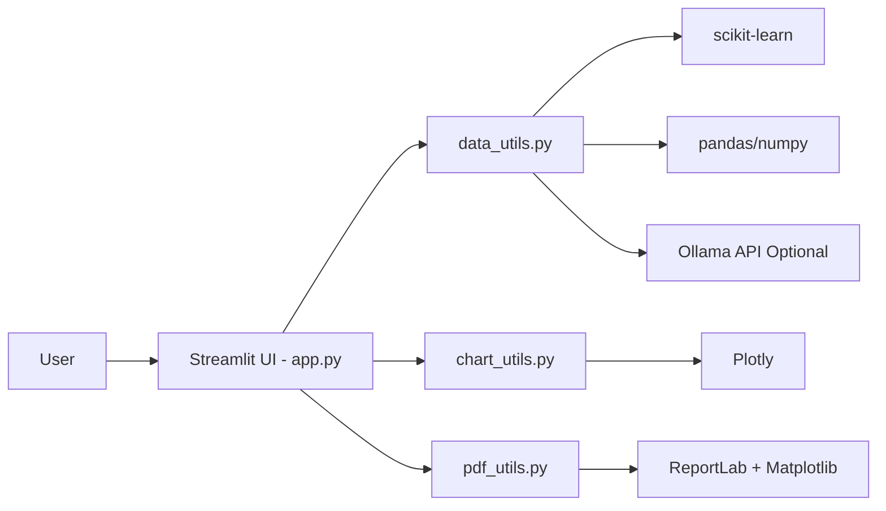
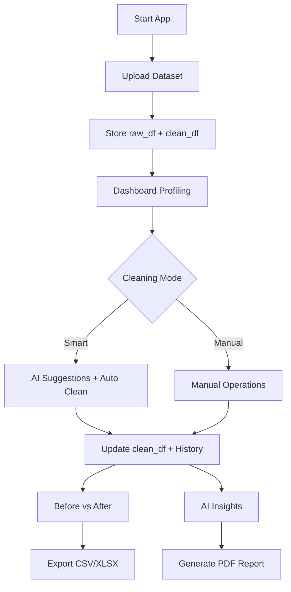
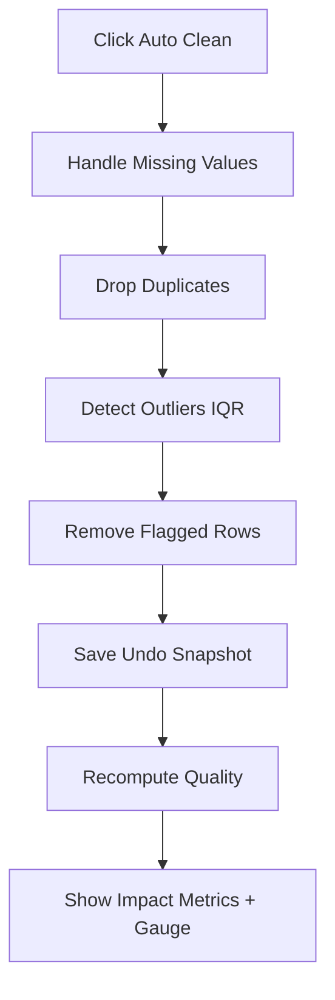
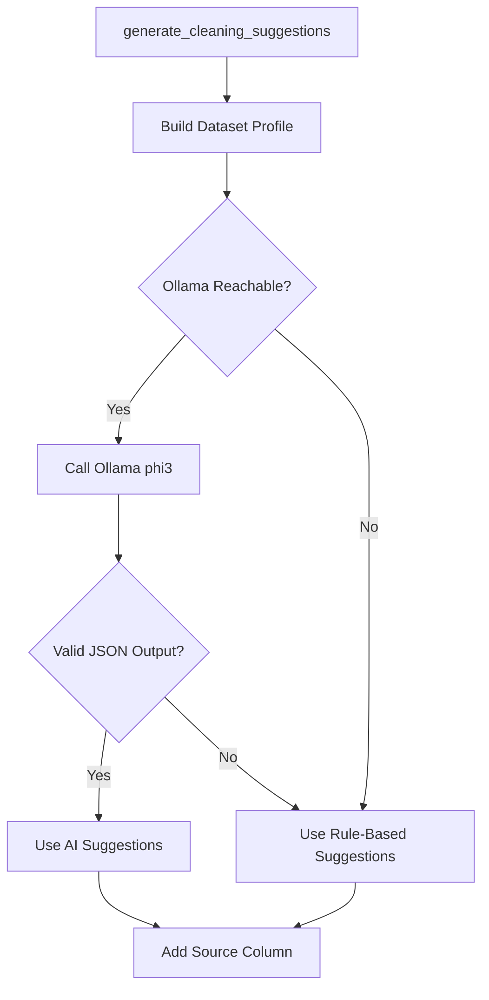
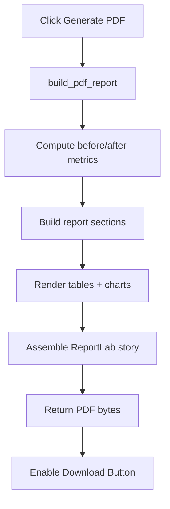
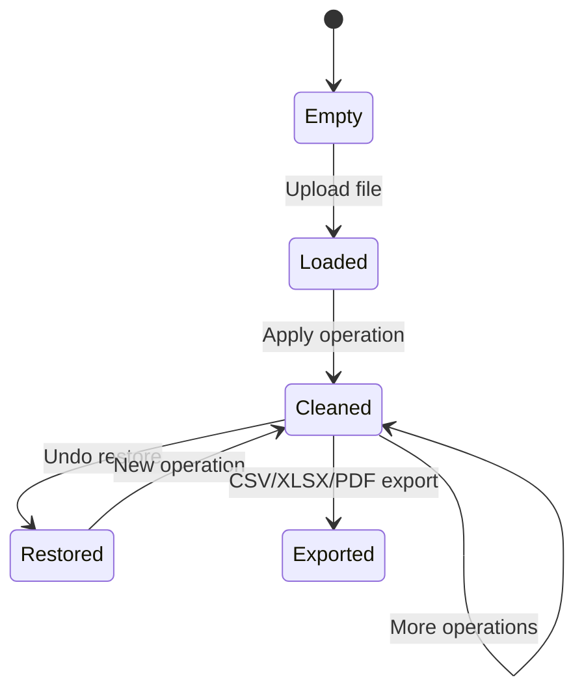

# DataRefine - AI Data Cleaner

DataRefine is a Streamlit-based data cleaning and profiling tool that helps you upload messy datasets, clean them with smart/manual operations, compare before-vs-after impact, generate AI insights, and export a professional PDF report.

## Features

- Upload CSV/XLS/XLSX files (up to 200 MB)
- Data quality dashboard (rows, columns, missing, duplicates, quality score)
- Smart cleaning with AI suggestions (Ollama) and rule-based fallback
- Manual cleaning operations (missing values, outliers, encoding, scaling, text cleanup)
- Before-vs-after comparison with metrics and charts
- AI insight charts (distribution, correlation, category, trend)
- Export cleaned dataset (CSV/XLSX) and PDF report

---

## System Architecture



---

## End-to-End Workflow



---

## Smart Cleaning Pipeline



---

## AI Suggestion Decision Flow



---

## Outlier Methods Overview

```mermaid
flowchart LR
    IQR[IQR Method] --> F1[Per-column bounds using Q1/Q3]
    Z[Z-Score Method] --> F2[abs(z) > threshold]
    Note[No Isolation Forest in current version]
```

---

## PDF Report Generation Pipeline



---

## Project Structure

```text
.
|- app.py
|- data_utils.py
|- chart_utils.py
|- pdf_utils.py
|- theme.py
|- requirements.txt
|- PROJECT_DOCS.md
`- README.md
```

---

## Key Modules

## `app.py`

- Handles Streamlit pages and navigation
- Manages `st.session_state`
- Coordinates cleaning actions, comparisons, and exports

## `data_utils.py`

- Dataset loading and profiling
- Missing-value handling
- Outlier detection (IQR, Z-score)
- Column ops, encoding, scaling, text standardization
- AI suggestions + fallback
- Insight discovery logic

## `chart_utils.py`

- Shared Plotly theming
- Dashboard/insight/comparison charts
- Quality gauge rendering

## `pdf_utils.py`

- ReportLab report assembly
- Statistical tables and preview tables
- Matplotlib chart generation and embedding

---

## Installation

1. Create and activate a virtual environment (recommended).
2. Install dependencies:

```bash
pip install -r requirements.txt
```

---

## Run the App

```bash
streamlit run app.py
```

Open the local URL shown in terminal (typically `http://localhost:8501`).

---

## Optional AI Configuration (Ollama)

If you want local AI suggestions:

- Start Ollama locally
- Set environment variables:

```bash
# Windows PowerShell
$env:OLLAMA_URL="http://localhost:11434/api/generate"
$env:OLLAMA_MODEL="phi3"
```

If Ollama is unavailable, app automatically uses rule-based suggestions.

---

## Data Lifecycle and State



- `raw_df`: original uploaded dataset
- `clean_df`: transformed working dataset
- `cleaning_history`: limited undo snapshots

---

## Typical User Flow

1. Upload dataset
2. Review dashboard quality
3. Get AI suggestions
4. Run smart clean or manual transformations
5. Check before-vs-after impact
6. View AI insights
7. Export cleaned data + PDF report

---

## Known Behavior / Notes

- Smart clean currently applies a default sequence (missing -> duplicates -> IQR outliers)
- Outlier cleaning supports IQR and Z-score methods
- If icon asset is missing, app uses fallback icon rendering
- PDF export handles edge case where cleaned dataset has zero columns

---

## Tech Stack

- Python
- Streamlit
- Pandas, NumPy
- Scikit-learn
- Plotly
- Matplotlib
- ReportLab
- OpenPyXL / xlrd

---

## Documentation

For detailed method-by-method explanation with examples, see:

- `PROJECT_DOCS.md`

